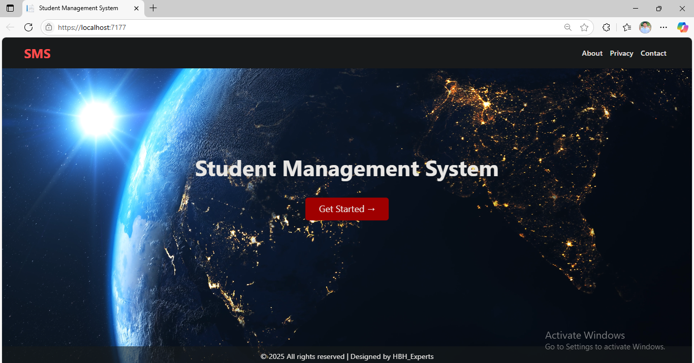
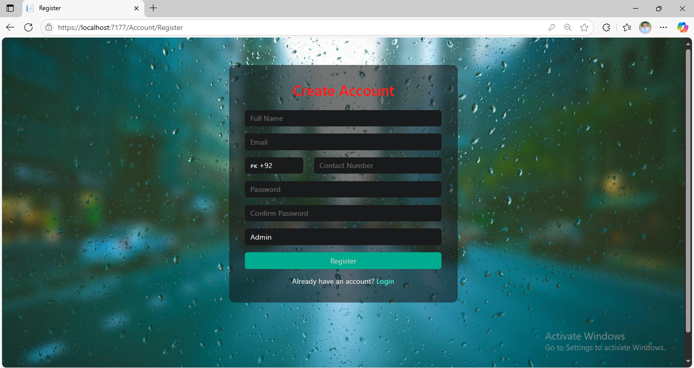
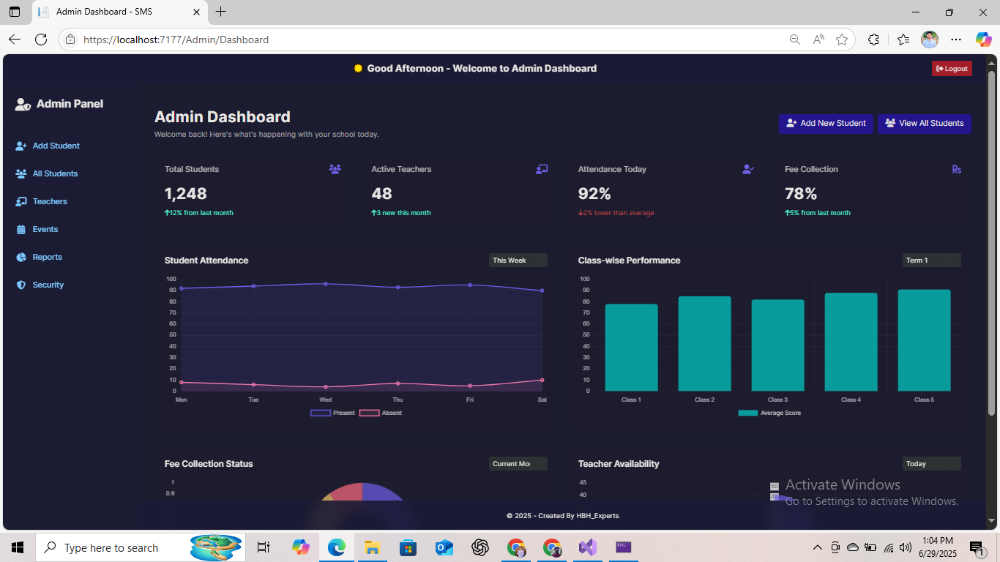
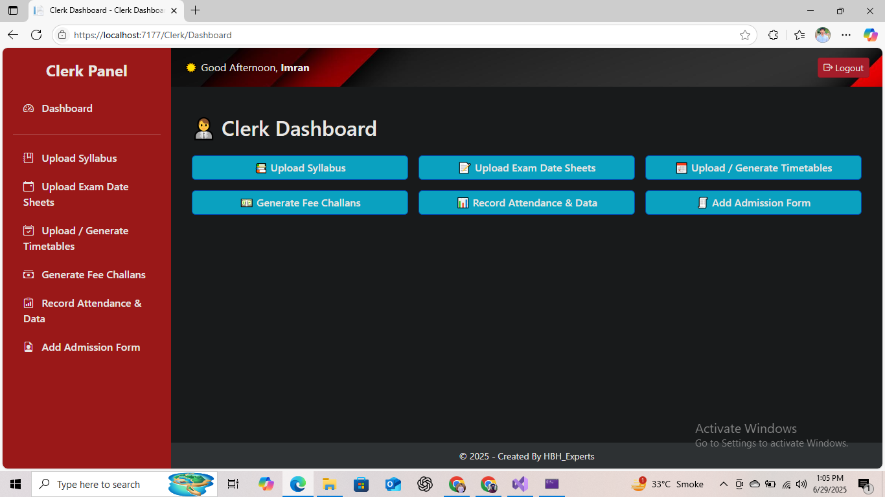
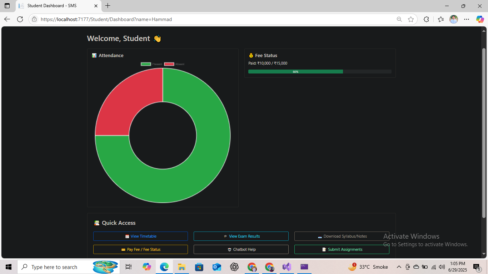

# 📚 Student Management System – ASP.NET MVC

A complete web-based **Student Management System** designed for educational institutions from **Play Group to 10th Class**. Built with modern ASP.NET MVC architecture and Entity Framework Core.

---

## 🚀 Features

- 🔐 Role-based login system (Admin, Clerk, Student, Parent, Principal)
- 🧑‍💼 Admin Dashboard:
  - Manage Users & Roles
  - Class/Subject Management
  - Approve AI-Generated Timetables
  - Backup & Security Settings
- 📊 Real-time charts:
  - Attendance (Pie/Bar)
  - Fee Collection per class
  - Teacher presence reports
- 📝 Student & Parent Portals:
  - Attendance, Fees, Results, Exams
- 💼 Clerk Portal:
  - Add/Edit students and teachers
  - Manage attendance & fee records

---

## 🛠️ Tech Stack

- **Frontend**: HTML, CSS, Bootstrap 5, Chart.js
- **Backend**: ASP.NET MVC 8, C#
- **Database**: MS SQL Server + Entity Framework Core
- **Version Control**: Git, GitHub

---

## 📸 Screenshots

### 🔹 Startup Page


### 🔹 Register Page


### 🔹 Admin Dashboard


### 🔹 Clerk Dashboard


### 🔹 Student Dashboard


---

## 🧑‍💻 Getting Started

1. Clone the repository:
   ```
   git clone https://github.com/HBDeveloper-62/StudentManagementSystem.git
   ```

2. Open the `.sln` file in **Visual Studio 2022+**

3. Update `appsettings.json` with your SQL Server connection string

4. Run EF Core migrations:
   ```
   Update-Database
   ```

5. Hit **F5** to run the project

---

## 📩 Contact

Developed by **HB .Net Developer**  
📧 hasnainbhutta262@gmail.com  
🌐 [LinkedIn Profile](https://www.linkedin.com/in/your-link-here)

---

## ⭐ Like this project?

Please give a ⭐ on GitHub to support!
